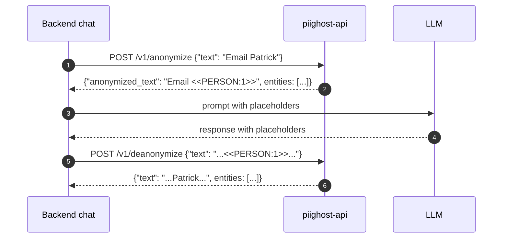

# PIIGhost API


[](https://pytest.org/)
[](https://docs.astral.sh/uv/)
[](https://docs.astral.sh/ruff/)

[README EN](README.md) - [README FR](README.fr.md)

[Documentation EN](https://athroniaeth.github.io/piighost-api/) - [Documentation FR](https://athroniaeth.github.io/piighost-api/fr/)

`piighost-api` est un serveur d'API REST pour l'anonymisation PII [piighost](https://github.com/Athroniaeth/piighost). La bibliothèque `piighost` s'intègre dans votre processus Python ; l'API héberge un unique pipeline configurable derrière HTTP afin que plusieurs processus (backends chat, jobs batch, notebooks) atteignent un seul endpoint d'inférence sans recharger les modèles ni dupliquer le cache.



## Fonctionnalités

- **Serveur d'inférence PII** : tout détecteur piighost (regex, GLiNER2, spaCy, …) chargé une fois, partagé entre les requêtes.
- **Endpoints d'anonymisation et de désanonymisation** : pipeline complet avec détection, linking et résolution d'entités.
- **Mémoire scopée par thread** : entités de conversation suivies par `thread_id` pour le linking inter-messages.
- **Authentification par clé d'API** : keyshield avec Argon2, scopes, expiration.
- **Cache Redis** : mappings d'anonymisation partagés via aiocache.
- **Pipeline configurable** : chemin d'import `module:variable` au démarrage.
- **CLI dataset HITL** : `piighost-api dataset extract|metrics` construit un jeu d'entrainement NER depuis les traces d'observation.

## Démarrage rapide

```bash
uv add piighost-api
piighost-api serve pipeline:pipeline --port 8000
```

Voir le [guide de démarrage rapide](https://athroniaeth.github.io/piighost-api/fr/getting-started/quickstart/) pour la marche à suivre complète, y compris le template `pipeline.py`.

Pour le chemin Docker :

```bash
docker pull ghcr.io/athroniaeth/piighost-api:latest
```

## Documentation

- [Installation](https://athroniaeth.github.io/piighost-api/fr/getting-started/installation/)
- [Démarrage rapide](https://athroniaeth.github.io/piighost-api/fr/getting-started/quickstart/)
- [Endpoints REST](https://athroniaeth.github.io/piighost-api/fr/reference/endpoints/)
- [CLI](https://athroniaeth.github.io/piighost-api/fr/reference/cli/)

## Licence

MIT.
