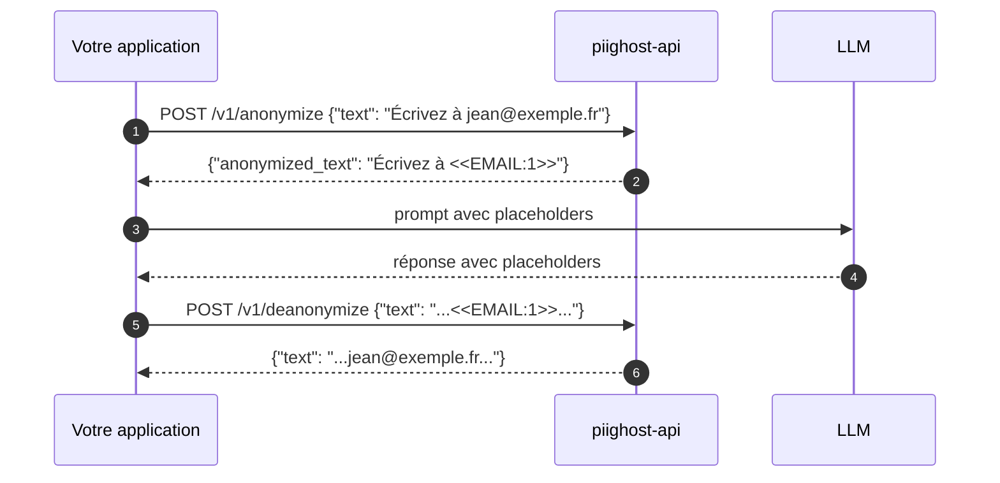

# piighost-api


[](https://pytest.org/)
[](https://docs.astral.sh/uv/)
[](https://docs.astral.sh/ruff/)
[](https://discord.gg/vFg9GHQR2s)

[README EN](README.md) - [README FR](README.fr.md)

`piighost-api` est un serveur HTTP qui héberge un pipeline de dé-identification [`piighost`](https://github.com/Athroniaeth/piighost), si bien que tous les processus d'une application partagent un seul modèle et une seule mémoire de conversation. Les valeurs confidentielles, données personnelles (PII) et secrets, sont remplacées par des placeholders avant que le texte n'atteigne le LLM, puis restaurées dans la réponse. Des proxys compatibles OpenAI et Anthropic font de même pour un client existant, en changeant seulement son URL de base.


```mermaid
sequenceDiagram
    autonumber
    participant C as Votre application
    participant A as piighost-api
    participant L as LLM

    C->>A: POST /v1/anonymize {"text": "Écrivez à jean@exemple.fr"}
    A-->>C: {"anonymized_text": "Écrivez à <<EMAIL:1>>"}
    C->>L: prompt avec placeholders
    L-->>C: réponse avec placeholders
    C->>A: POST /v1/deanonymize {"text": "...<<EMAIL:1>>..."}
    A-->>C: {"text": "...jean@exemple.fr..."}
```

## Démarrage rapide

```bash
uv add piighost-api   # ou : pip install piighost-api
```

Le serveur refuse de démarrer sans clé d'API. Pour un essai local, activez le mode anonyme, puis servez une configuration du [hub piighost](https://hub.piighost.dev) :

```bash
export PIIGHOST_ALLOW_ANONYMOUS=true
piighost-api serve --config hub:piighost/fr-default:e6990159
```

```bash
curl -X POST http://127.0.0.1:8000/v1/anonymize \
  -H "Content-Type: application/json" \
  -d '{"text": "Appelez le 06 12 34 56 78 ou écrivez à jean@exemple.fr", "thread_id": "demo"}'
```

La réponse porte `"anonymized_text": "Appelez le <<FR_PHONE:1>> ou écrivez à <<EMAIL:1>>"`, et `/v1/deanonymize` avec le même `thread_id` la restaure. `fr-default` ne contient que des regex, donc rien d'autre n'est téléchargé. Une configuration avec un modèle, comme `hub:piighost/support-en:286909f6`, demande `piighost-api[gliner2]`.

## Documentation

Le serveur est documenté avec la librairie, sur [athroniaeth.github.io/piighost](https://athroniaeth.github.io/piighost/fr/).

- [Déployer une API de dé-identification](https://athroniaeth.github.io/piighost/fr/getting-started/api-server/), le tutoriel : une clé d'API, une configuration du hub avec un modèle, un aller-retour
- [Proxy compatible OpenAI](https://athroniaeth.github.io/piighost/fr/examples/openai-proxy/) et [proxy compatible Anthropic](https://athroniaeth.github.io/piighost/fr/examples/anthropic-proxy/)
- [Routes](https://athroniaeth.github.io/piighost/fr/reference/api-endpoints/) et [ligne de commande et variables d'environnement](https://athroniaeth.github.io/piighost/fr/reference/api-cli/)
- [Déploiement avec Docker](https://athroniaeth.github.io/piighost/fr/deployment/) et le [client distant](https://athroniaeth.github.io/piighost/fr/getting-started/api-client/) de la librairie

## Communauté

Rejoignez le [Discord](https://discord.gg/vFg9GHQR2s) pour obtenir de l'aide, signaler un bug ou demander une fonctionnalité.

## Licence

MIT.
