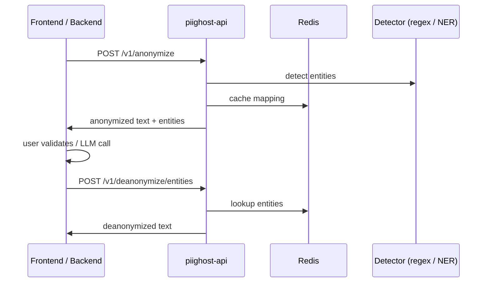

# PIIGhost API


[](https://pytest.org/)
[](https://docs.astral.sh/uv/)
[](https://docs.astral.sh/ruff/)

`piighost-api` is a REST API server for [piighost](https://github.com/Athroniaeth/piighost) PII anonymization inference. It loads a configurable pipeline once server-side and exposes anonymization/deanonymization via HTTP, so clients only need a lightweight HTTP client.

## Features

- **PII inference server** — any piighost detector (regex, GLiNER2, spaCy, …) loaded once, shared across requests
- **Anonymize / deanonymize endpoints** — full pipeline with entity detection, linking, and resolution
- **Thread-scoped memory** — conversation entities tracked per `thread_id` for cross-message linking
- **API key authentication** — [keyshield](https://github.com/Athroniaeth/keyshield) with Argon2 hashing, scopes, and expiration
- **Redis cache** — anonymization mappings and detection results persisted via aiocache
- **Configurable pipeline** — specify a Python file at startup (`module:variable` pattern, like uvicorn)
- **Python async client** — `PIIGhostClient` in `piighost[client]` via httpx

## Quick start

### 1. Create your pipeline

Create a `pipeline.py` that configures the anonymization pipeline. The base image ships with regex detectors only (218 MB). For NER-based detection, install extras via `EXTRA_PACKAGES` or `PIIGHOST_EXTRAS`.

**Regex-only (no extra dependencies):**

```python
from piighost.anonymizer import Anonymizer
from piighost.detector import RegexDetector
from piighost.linker.entity import ExactEntityLinker
from piighost.pipeline.thread import ThreadAnonymizationPipeline
from piighost.placeholder import CounterPlaceholderFactory
from piighost.resolver.entity import MergeEntityConflictResolver
from piighost.resolver.span import ConfidenceSpanConflictResolver

pipeline = ThreadAnonymizationPipeline(
    detector=RegexDetector(patterns={
        "EMAIL": r"[a-zA-Z0-9._%+\-]+@[a-zA-Z0-9.\-]+\.[a-zA-Z]{2,}",
        "PHONE": r"\+\d{1,3}[\s.\-]?\(?\d{1,4}\)?(?:[\s.\-]?\d{1,4}){1,4}",
    }),
    span_resolver=ConfidenceSpanConflictResolver(),
    entity_linker=ExactEntityLinker(),
    entity_resolver=MergeEntityConflictResolver(),
    anonymizer=Anonymizer(CounterPlaceholderFactory()),
)
```

**With GLiNER2 (requires `piighost[gliner2]`):**

```python
from gliner2 import GLiNER2
from piighost.anonymizer import Anonymizer
from piighost.detector.gliner2 import Gliner2Detector
from piighost.pipeline.thread import ThreadAnonymizationPipeline
from piighost.placeholder import CounterPlaceholderFactory
from piighost.resolver.entity import MergeEntityConflictResolver
from piighost.resolver.span import ConfidenceSpanConflictResolver

model = GLiNER2.from_pretrained("fastino/gliner2-multi-v1")

pipeline = ThreadAnonymizationPipeline(
    detector=Gliner2Detector(model=model, labels=["PERSON", "LOCATION"], threshold=0.5),
    span_resolver=ConfidenceSpanConflictResolver(),
    entity_linker=ExactEntityLinker(),
    entity_resolver=MergeEntityConflictResolver(),
    anonymizer=Anonymizer(CounterPlaceholderFactory()),
)
```

### 2. Start with Docker Compose

```yaml
# docker-compose.yml
services:
  api:
    image: ghcr.io/athroniaeth/piighost-api:latest
    ports:
      - "8000:8000"
    environment:
      - REDIS_URL=redis://redis:6379
      - SECRET_PEPPER=${SECRET_PEPPER}
      - API_KEY_default=${API_KEY}
      # Install optional extras at startup (e.g. for GLiNER2 pipeline)
      - EXTRA_PACKAGES=piighost[gliner2]
    volumes:
      - ./pipeline.py:/app/pipeline.py
      - huggingface-cache:/root/.cache/huggingface
    depends_on:
      - redis

  redis:
    image: redis:7-alpine
    ports:
      - "6379:6379"
    volumes:
      - redis-data:/data

volumes:
  redis-data:
  huggingface-cache:
```

```bash
docker compose up
```

#### Installing extra dependencies

**At runtime** (pre-built image, installs on each startup):
```yaml
environment:
  - EXTRA_PACKAGES=piighost[gliner2]
```

**At build time** (custom image, baked in):
```bash
docker build --build-arg PIIGHOST_EXTRAS="gliner2,faker" -t my-piighost-api .
```

> If no valid `API_KEY_*` environment variables are set, the server starts with authentication **disabled** (a warning is logged).

### 3. Test the API

```bash
# Get pipeline configuration
curl http://localhost:8000/v1/config

# Anonymize
curl -X POST http://localhost:8000/v1/anonymize \
  -H "Content-Type: application/json" \
  -d '{"text": "Patrick habite a Paris", "thread_id": "conv-1"}'

# Deanonymize (cache-based)
curl -X POST http://localhost:8000/v1/deanonymize \
  -H "Content-Type: application/json" \
  -d '{"text": "<<PERSON_1>> habite a <<LOCATION_1>>", "thread_id": "conv-1"}'

# Deanonymize (entity-based, for LLM responses)
curl -X POST http://localhost:8000/v1/deanonymize/entities \
  -H "Content-Type: application/json" \
  -d '{"text": "<<PERSON_1>> aime <<LOCATION_1>>", "thread_id": "conv-1"}'
```

## API endpoints

### `GET /v1/config`

Returns the pipeline configuration (detected labels, placeholder factory type).

```json
{
  "labels": ["PERSON", "LOCATION"],
  "placeholder_factory": "CounterPlaceholderFactory"
}
```

### `POST /v1/anonymize`

Anonymizes text with full NER detection.

**Request:**
```json
{
  "text": "Patrick habite a Paris",
  "thread_id": "conv-1"
}
```

**Response:**
```json
{
  "anonymized_text": "<<PERSON_1>> habite a <<LOCATION_1>>",
  "entities": [
    {
      "label": "PERSON",
      "placeholder": "<<PERSON_1>>",
      "detections": [
        {"text": "Patrick", "label": "PERSON", "start_pos": 0, "end_pos": 7, "confidence": 0.99}
      ]
    },
    {
      "label": "LOCATION",
      "placeholder": "<<LOCATION_1>>",
      "detections": [
        {"text": "Paris", "label": "LOCATION", "start_pos": 17, "end_pos": 22, "confidence": 0.92}
      ]
    }
  ]
}
```

### `POST /v1/deanonymize`

Deanonymizes text via cache lookup (the text must have been anonymized by this pipeline).

Returns `404` if the text is not found in cache.

### `POST /v1/deanonymize/entities`

Deanonymizes text via entity-based token replacement. Works on any text containing placeholder tokens (e.g. LLM-generated responses).

## Python client

Install the client extra in your project:

```bash
uv add piighost[client]
```

```python
from piighost.client import PIIGhostClient

async with PIIGhostClient("http://localhost:8000", api_key="ak_v1-...") as client:
    config = await client.get_config()
    print(config["labels"])  # ["PERSON", "LOCATION"]

    text, entities = await client.anonymize("Patrick habite a Paris")
    print(text)  # <<PERSON_1>> habite a <<LOCATION_1>>

    original, _ = await client.deanonymize(text)
    print(original)  # Patrick habite a Paris

    # For LLM responses
    result = await client.deanonymize_with_ent("<<PERSON_1>> aime <<LOCATION_1>>")
    print(result)  # Patrick aime Paris
```

## Custom pipeline

The server loads a `ThreadAnonymizationPipeline` from a Python file using the `module:variable` pattern (like uvicorn):

```bash
piighost-api serve myconfig:pipeline --host 0.0.0.0 --port 8000
```

This imports `myconfig.py` and uses the `pipeline` variable. You can configure any piighost detector, resolver, linker, and placeholder factory.

## Authentication

The API uses [keyshield](https://github.com/Athroniaeth/keyshield) for API key management. Keys are loaded from environment variables with the `API_KEY_` prefix:

```bash
export SECRET_PEPPER="your-secret-pepper"
export API_KEY_default="ak_v1-<key_id>-<key_secret>"
```

Requests must include the key in the `Authorization` header:

```bash
curl -H "Authorization: Bearer ak_v1-..." http://localhost:8000/v1/config
```

If no valid keys are configured, the server starts without authentication (development mode).

## Architecture



## Ecosystem

- **[piighost](https://github.com/Athroniaeth/piighost)** — Core PII anonymization library with regex detectors, optional NER (GLiNER2, spaCy, transformers), entity linking, and LangChain middleware.
- **[piighost-chat](https://github.com/Athroniaeth/piighost-chat)** — Demo chat app using this API for real-time PII detection and a LangChain agent with `PIIAnonymizationMiddleware` for privacy-preserving AI conversations.

## Development

```bash
uv sync                      # Install dependencies
make lint                    # Format (ruff), lint (ruff), type-check (pyrefly)
uv run pytest                # Run all tests (100% coverage)
make docker-up               # Start Docker services
make docker-down             # Stop Docker services
```

## Contributing

- **Commits**: Conventional Commits via Commitizen (`feat:`, `fix:`, `refactor:`, etc.)
- **Type checking**: PyReFly (not mypy)
- **Formatting/linting**: Ruff
- **Package manager**: uv (not pip)
- **Python**: 3.12+
