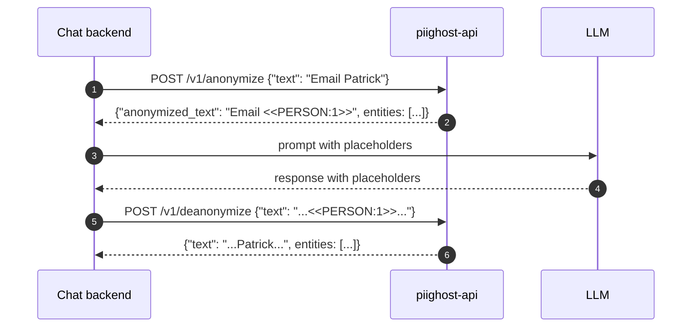

# PIIGhost API


[](https://pytest.org/)
[](https://docs.astral.sh/uv/)
[](https://docs.astral.sh/ruff/)

[README EN](README.md) - [README FR](README.fr.md)

[Documentation EN](https://athroniaeth.github.io/piighost-api/) - [Documentation FR](https://athroniaeth.github.io/piighost-api/fr/)

`piighost-api` is a REST API server for [piighost](https://github.com/Athroniaeth/piighost) PII anonymization. The library `piighost` embeds in your Python process; the API hosts a single configurable pipeline behind HTTP so multiple processes (chat backends, batch jobs, notebooks) hit one inference endpoint without re-loading models or duplicating cache state.



## Features

- **PII inference server** : any piighost detector (regex, GLiNER2, spaCy, …) loaded once, shared across requests.
- **Anonymize / deanonymize endpoints** : full pipeline with entity detection, linking, and resolution.
- **Thread-scoped memory** : conversation entities tracked per `thread_id` for cross-message linking.
- **API key authentication** : keyshield with Argon2, scopes, expiration.
- **Redis cache** : shared anonymization mappings via aiocache.
- **Configurable pipeline** : `module:variable` import path at startup.
- **HITL dataset CLI** : `piighost-api dataset extract|metrics` builds a NER training set from observation traces.

## Quick start

```bash
uv add piighost-api
piighost-api serve pipeline:pipeline --port 8000
```

See the [Quickstart guide](https://athroniaeth.github.io/piighost-api/getting-started/quickstart/) for the full walk-through, including the `pipeline.py` template.

For the Docker path:

```bash
docker pull ghcr.io/athroniaeth/piighost-api:latest
```

## Environment variables

| Variable | Default | Description |
| --- | --- | --- |
| `PIIGHOST_ALLOW_ANONYMOUS` | unset | The server refuses to start without valid `API_KEY_<name>` entries. Set to `true` (or `1`, `yes`, `on`) to explicitly opt in to serving PII endpoints without authentication. |
| `PIIGHOST_MAX_BODY_BYTES` | `1000000` | Maximum request body size in bytes. Larger requests are rejected with HTTP 413 before any NER inference runs. |
| `PIIGHOST_RATE_LIMIT` | unset | Per-client rate limit as `<unit>:<count>` (e.g. `minute:300`, units: `second`, `minute`, `hour`, `day`). Excess requests get HTTP 429. `/` and `/health` are exempt. Disabled when unset. |

## Documentation

- [Installation](https://athroniaeth.github.io/piighost-api/getting-started/installation/)
- [Quickstart](https://athroniaeth.github.io/piighost-api/getting-started/quickstart/)
- [REST endpoints](https://athroniaeth.github.io/piighost-api/reference/endpoints/)
- [CLI](https://athroniaeth.github.io/piighost-api/reference/cli/)

## License

MIT.
