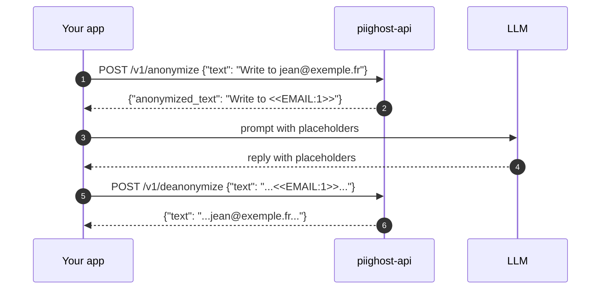

# piighost-api


[](https://pytest.org/)
[](https://docs.astral.sh/uv/)
[](https://docs.astral.sh/ruff/)
[](https://discord.gg/vFg9GHQR2s)

[README EN](README.md) - [README FR](README.fr.md)

`piighost-api` is an HTTP server that hosts one [`piighost`](https://github.com/Athroniaeth/piighost) de-identification pipeline, so every process of an application shares one model and one conversation memory. Confidential values, personal data (PII) and secrets, are replaced by placeholders before the text reaches the LLM, then restored in the reply. OpenAI- and Anthropic-compatible proxies do the same for an existing client with a base URL change.


```mermaid
sequenceDiagram
    autonumber
    participant C as Your app
    participant A as piighost-api
    participant L as LLM

    C->>A: POST /v1/anonymize {"text": "Write to jean@exemple.fr"}
    A-->>C: {"anonymized_text": "Write to <<EMAIL:1>>"}
    C->>L: prompt with placeholders
    L-->>C: reply with placeholders
    C->>A: POST /v1/deanonymize {"text": "...<<EMAIL:1>>..."}
    A-->>C: {"text": "...jean@exemple.fr..."}
```

## Quickstart

```bash
uv add piighost-api   # or: pip install piighost-api
```

The server refuses to start without an API key. For a local trial, opt in to anonymous mode, then serve a configuration from the [piighost hub](https://hub.piighost.dev):

```bash
export PIIGHOST_ALLOW_ANONYMOUS=true
piighost-api serve --config hub:piighost/fr-default:e6990159
```

```bash
curl -X POST http://127.0.0.1:8000/v1/anonymize \
  -H "Content-Type: application/json" \
  -d '{"text": "Appelez le 06 12 34 56 78 ou écrivez à jean@exemple.fr", "thread_id": "demo"}'
```

The reply carries `"anonymized_text": "Appelez le <<FR_PHONE:1>> ou écrivez à <<EMAIL:1>>"`, and `/v1/deanonymize` with the same `thread_id` restores it. `fr-default` is regex only, so nothing else is downloaded. A configuration with a model, such as `hub:piighost/support-en:286909f6`, needs `piighost-api[gliner2]`.

## Documentation

The server is documented with the library, at [athroniaeth.github.io/piighost](https://athroniaeth.github.io/piighost/).

- [Deploy a de-identification API](https://athroniaeth.github.io/piighost/getting-started/api-server/), the tutorial: an API key, a hub configuration with a model, a round trip
- [OpenAI-compatible proxy](https://athroniaeth.github.io/piighost/examples/openai-proxy/) and [Anthropic-compatible proxy](https://athroniaeth.github.io/piighost/examples/anthropic-proxy/)
- [Routes](https://athroniaeth.github.io/piighost/reference/api-endpoints/) and [command line and environment variables](https://athroniaeth.github.io/piighost/reference/api-cli/)
- [Deployment with Docker](https://athroniaeth.github.io/piighost/deployment/) and the [remote client](https://athroniaeth.github.io/piighost/getting-started/api-client/) of the library

## Community

Join the [Discord](https://discord.gg/vFg9GHQR2s) to get help, report bugs and request features.

## License

MIT.
