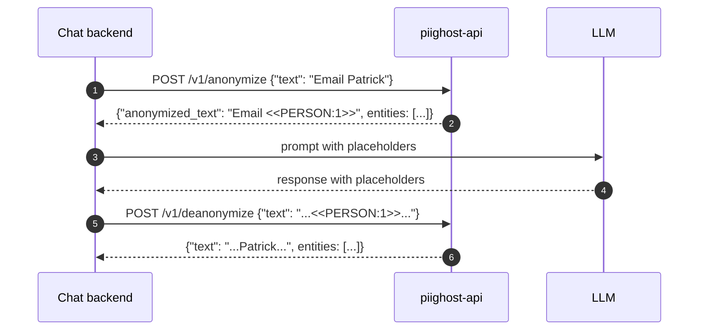

# PIIGhost API

`piighost-api` is a REST API server that hosts a [piighost](https://github.com/Athroniaeth/piighost) anonymization pipeline behind HTTP. The library `piighost` embeds in your Python process; the API hosts a single configurable pipeline so multiple processes (chat backends, batch jobs, notebooks) hit one inference endpoint without re-loading models or duplicating cache state.

Use `piighost-api` when:

- You run **multiple consumers** of the same pipeline (a chat backend plus an offline batch job) and want them to share detections + thread-scoped memory.
- You want **language-agnostic** access to the pipeline (any HTTP client works, not just Python).
- You need **shared caching** across instances (Redis backend) or **API key authentication** in front of the inference endpoint.

For a single Python process, prefer the `piighost` library directly.

## Request flow

<figcaption>A consumer (chat backend) anonymises text via the API before sending it to the LLM, then deanonymises the response on its way back to the user. The pipeline only loads on the API side.</figcaption>

## Differentiators

- **PII inference server** — any piighost detector (regex, GLiNER2, spaCy, …) loaded once, shared across requests.
- **Anonymize / deanonymize endpoints** — full pipeline with entity detection, linking, and resolution.
- **Thread-scoped memory** — conversation entities tracked per `thread_id` for cross-message linking.
- **API key authentication** — [keyshield](https://github.com/Athroniaeth/keyshield) with Argon2 hashing, scopes, and expiration.
- **Redis cache** — anonymization mappings and detection results persisted via aiocache.
- **Configurable pipeline** — specify a Python file at startup (`module:variable` pattern).
- **HITL dataset CLI** — `piighost-api dataset extract|metrics` builds a NER training set from the observation backend.

## Next steps

- [Installation](getting-started/installation.md) — install via uv, pip, or Docker.
- [Quickstart](getting-started/quickstart.md) — write a `pipeline.py` and make your first request.
- [REST endpoints](reference/endpoints.md) — full API reference.
- [CLI](reference/cli.md) — `serve`, `dataset extract`, `dataset metrics`.
