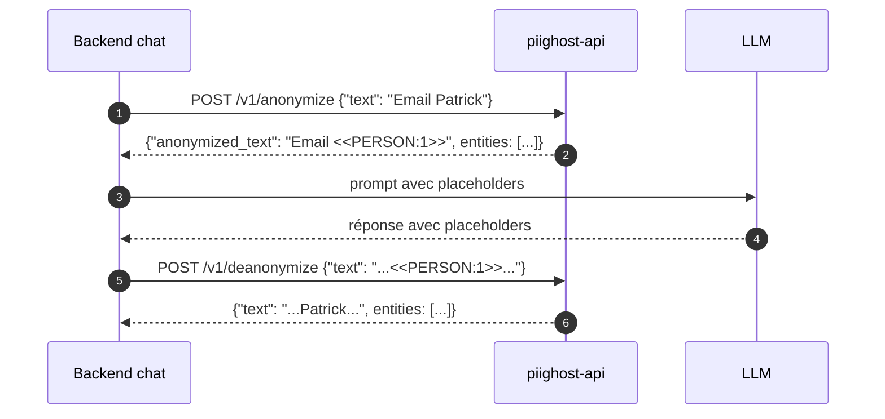

# PIIGhost API

`piighost-api` est un serveur d'API REST qui héberge un pipeline d'anonymisation [piighost](https://github.com/Athroniaeth/piighost) derrière HTTP. La bibliothèque `piighost` s'intègre dans votre processus Python ; l'API héberge un unique pipeline configurable afin que plusieurs processus (backends chat, jobs batch, notebooks) atteignent un seul endpoint d'inférence sans recharger les modèles ni dupliquer le cache.

Utilisez `piighost-api` quand :

- Vous avez **plusieurs consommateurs** du même pipeline (un backend chat et un job batch hors-ligne) et souhaitez qu'ils partagent les détections et la mémoire scopée par thread.
- Vous voulez un **accès agnostique au langage** vers le pipeline (n'importe quel client HTTP fonctionne, pas seulement Python).
- Vous avez besoin d'un **cache partagé** entre instances (backend Redis) ou d'une **authentification par clé d'API** devant l'endpoint d'inférence.

Pour un seul processus Python, préférez la bibliothèque `piighost` directement.

## Flux de requête

<figcaption>Un consommateur (backend chat) anonymise le texte via l'API avant de l'envoyer au LLM, puis désanonymise la réponse sur le chemin retour vers l'utilisateur. Le pipeline est chargé uniquement côté API.</figcaption>

## Différenciateurs

- **Serveur d'inférence PII** : n'importe quel détecteur piighost (regex, GLiNER2, spaCy, …) chargé une fois, partagé entre les requêtes.
- **Endpoints d'anonymisation et de désanonymisation** : pipeline complet avec détection, liaison et résolution des entités.
- **Mémoire scopée par thread** : entités de conversation suivies par `thread_id` pour la liaison inter-messages.
- **Authentification par clé d'API** : [keyshield](https://github.com/Athroniaeth/keyshield) avec hachage Argon2, scopes et expiration.
- **Cache Redis** : mappings d'anonymisation et résultats de détection persistés via aiocache.
- **Pipeline configurable** : spécifiez un fichier Python au démarrage (pattern `module:variable`).
- **CLI dataset HITL** : `piighost-api dataset extract|metrics` construit un jeu de données d'entraînement NER à partir du backend d'observation.

## Suite

- [Installation](getting-started/installation.md) — installation via uv, pip ou Docker.
- [Démarrage rapide](getting-started/quickstart.md) — écrire un `pipeline.py` et effectuer votre première requête.
- [Endpoints REST](reference/endpoints.md) — référence complète de l'API.
- [CLI](reference/cli.md) — `serve`, `dataset extract`, `dataset metrics`.
